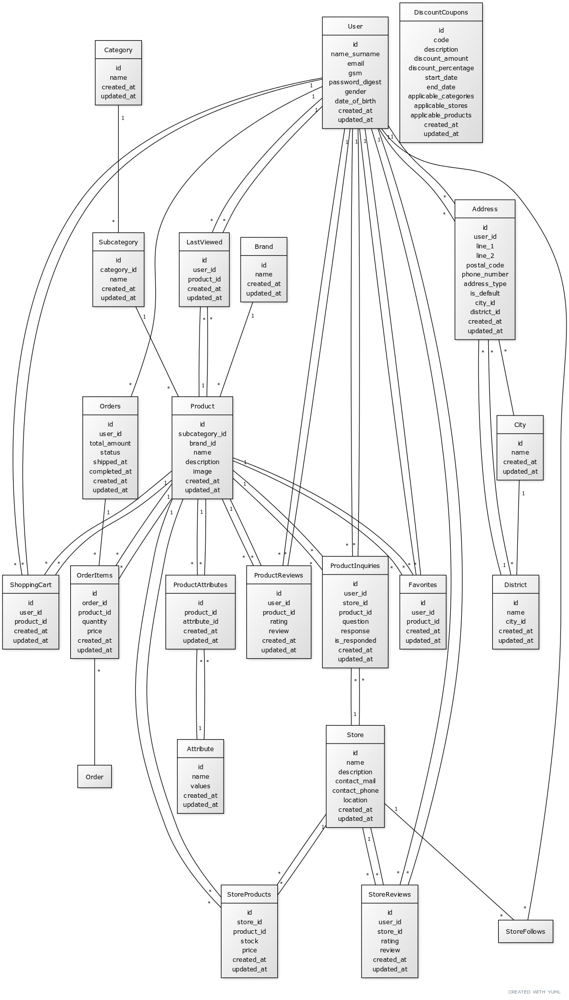

# E-Commerce Project

Welcome to the E-Commerce Project!

## Overview

This repository is for an ongoing e-commerce project. The project is being actively developed, and new features and updates are being added regularly.

## Current Status

- **Initial Setup:** The project has been created with Ruby on Rails 7.2.1 and PostgreSQL.
- **Migration:** Today, we created the first migration file and established the initial database schema. This is a foundational step, and the migration will be detailed and expanded as development progresses.

## Development

I am actively working on this project and plan to add new functionalities and improvements on a daily basis. The roadmap includes:

- Setting up the database schema and initial migrations
- Implementing user authentication and authorization
- Developing core e-commerce features such as product management, shopping cart, and order processing
- Integrating payment gateways and additional functionalities
- Enhancing the user interface and experience

