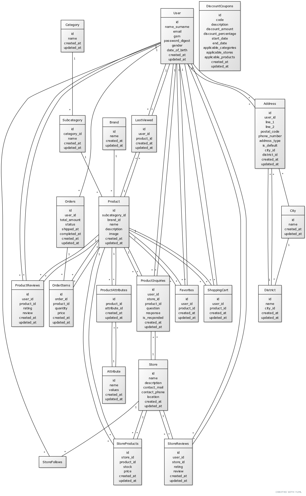

# 🚀 E-Commerce Application Development with Rails

In this project, my goal is to develop a full-featured **e-commerce application** using **Ruby on Rails**. Initially, I'll focus on building the web platform, with plans to extend it for mobile compatibility later. To kickstart the project, I'm using my custom **Rails Template**: [rails_template](https://github.com/hamzagedikkaya/rails_template). Feel free to use this as a foundation after making the necessary tweaks to suit your needs.

---

🌱 This is a **public project** where I make daily updates as part of my learning and development journey. The goal is continuous improvement, adding new features, and optimizing the system regularly. Follow along as the project evolves!

---

For more details about the custom template and an in-depth explanation of how this project is being built, check out my blog at [hamzagedikkaya.github.io](https://hamzagedikkaya.github.io) where I share the development process step by step.

---

### 🔧 Initial Database Model

Here’s the initial database model I’ve set up, although it's likely to change as the project grows and new requirements come into play:

---

Stay tuned for more updates as I continue to build and enhance the app! 💻📱
